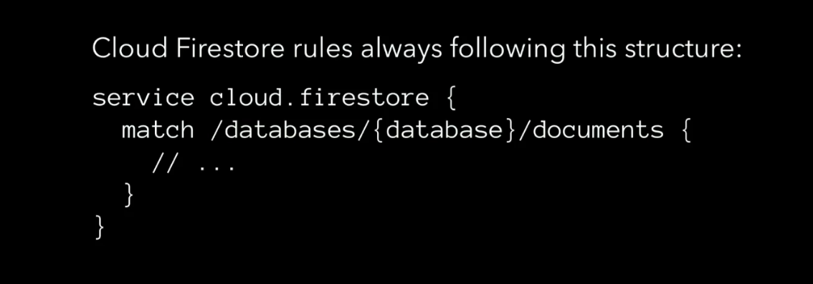
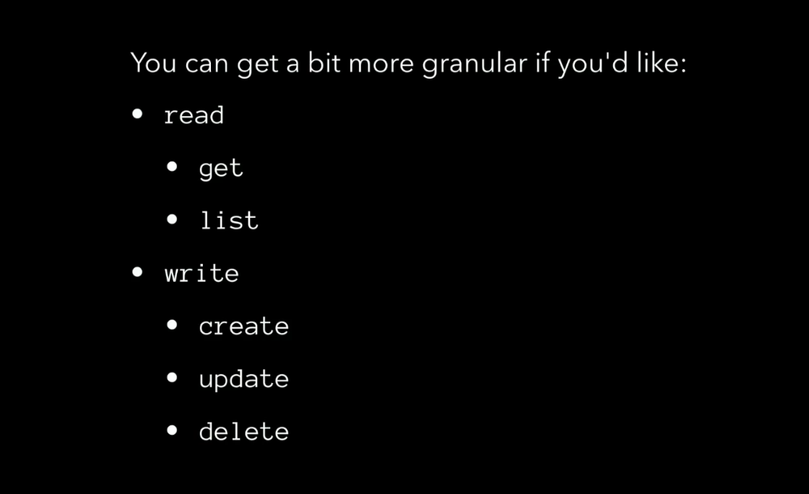
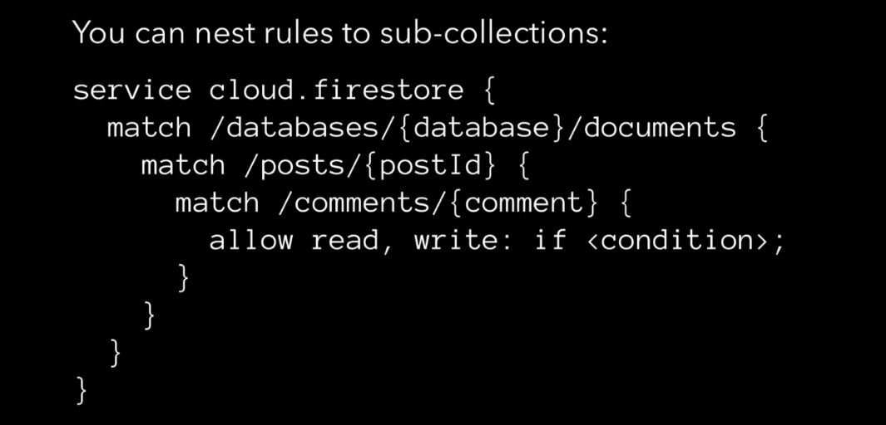
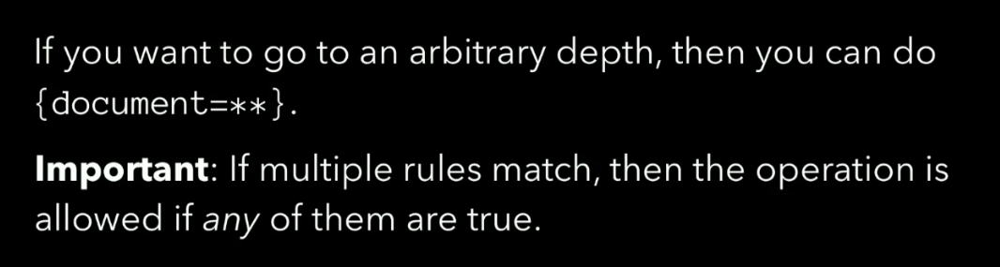
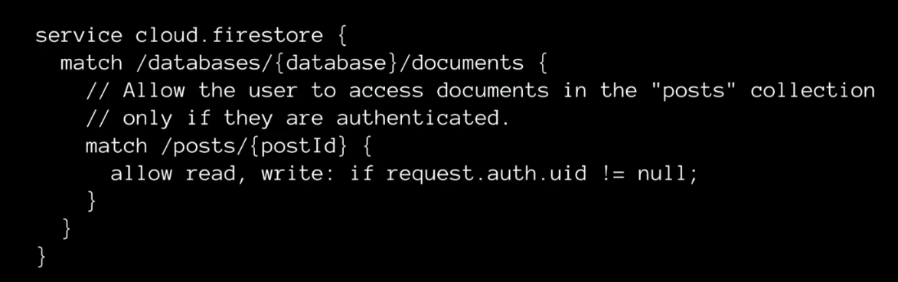
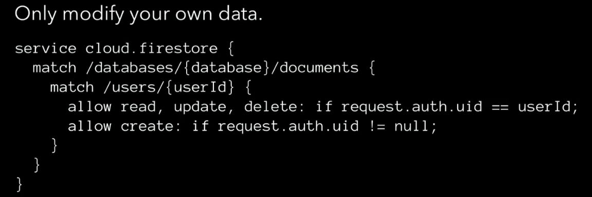
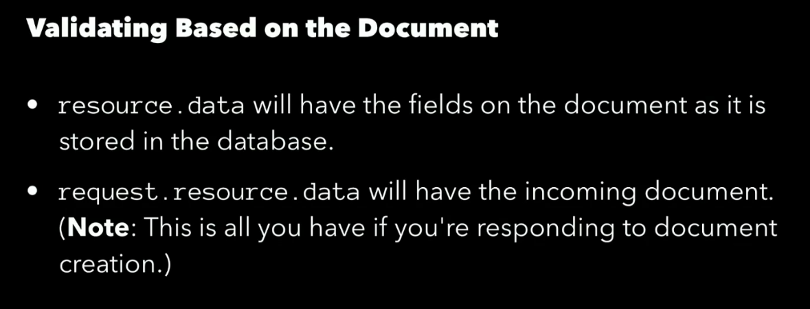
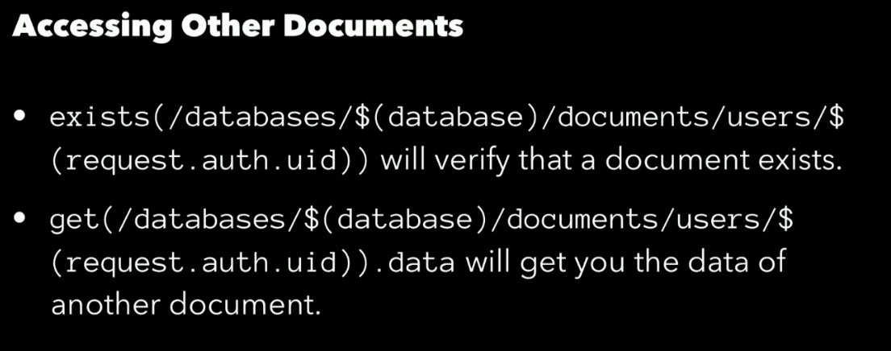
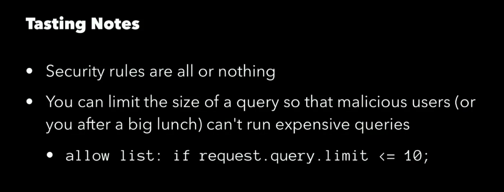
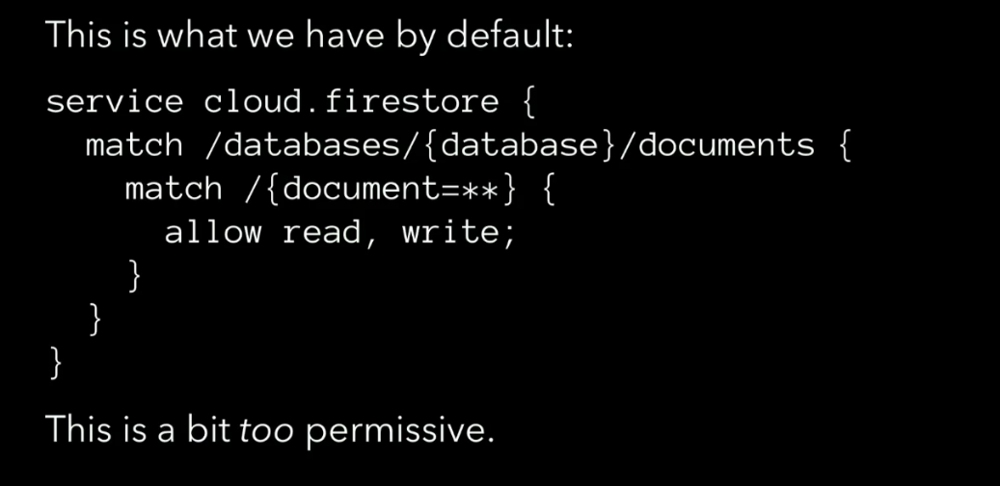

# Firestore

Link: [https://firebase.google.com/](https://firebase.google.com/)

- Clould functions: Similar to AWS lamda, triggers events based on data change
- Cloud firestore: Previously known as Realtime Database. It is based on collections

- Realtime Database: Cheaper and used for tons of reads and write. Example: capturing every pen strokes on writing/ scribbling. Its data structure is a huge JSON tree.

NOTE: Duplication of data is fine in noSQL databases. Thinking from the UI perspective helps in development and by levering the `cloud function` we could update duplicate data throughout our database.

Traversing using collections and documents in firestore could be done 2 ways:

Here is how we could retrieve data from firestore
1. Ordering: `firestore.colection('posts').orderBy('createdAt','desc');`
2. Limit/Paginate: `firestore.collection('posts').limit(10);`
3. Querying: `firestore.collection('posts').where('stars', '>=', 10);`

## Security Rules

